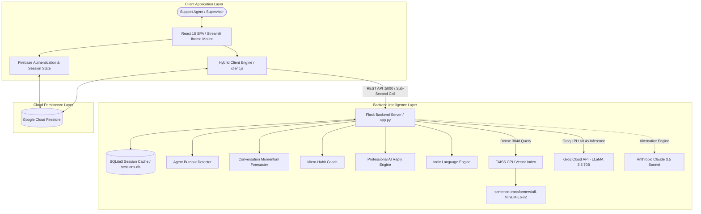

# OmniDesk Copilot — Developer & Technical Documentation
**Version:** 2.1.0  
**Status:** Production Ready  
**Live Deployed Platform:** [customer-support-agent12.streamlit.app](https://customer-support-agent12.streamlit.app/)  
**Source Repository:** [Guptanshu44/Customer-support-assistant](https://github.com/Guptanshu44/Customer-support-assistant.git)

---

## 1. Executive Summary & Architectural Overview

**OmniDesk Copilot** is an enterprise-grade, real-time AI customer support intelligence and agent coaching platform. Engineered to operate during live customer interactions with sub-second latency (**<0.4s**), the platform provides support agents with instant behavioral coaching, draft response scoring, compliance guardrails, vector knowledge base retrieval, emotional exhaustion tracking, and predictive outcome forecasting.

### 1.1 Dual-Runtime Hybrid Architecture
OmniDesk Copilot is built to run simultaneously in two production environments:
1. **Standalone Enterprise Stack:** A decoupled React 18 Single-Page Application communicating via REST and WebSocket APIs to a Python Flask server backed by FAISS and SQLite.
2. **Streamlit Cloud Deployment:** A single-file compiled SPA bundle (`frontend/dist/index.html` compiled with `vite-plugin-singlefile`) served inside an isolated, full-viewport Streamlit component iframe (`streamlit_app.py`) with Google Cloud Firestore backing for zero-infrastructure hosting.



---

## 2. Core Intelligence Engines Deep-Dive

All coaching intelligence modules reside under `coaching_assistant/`.

### 2.1 Unified AI Coach Orchestrator (`coaching_assistant/coach.py`)
- **Primary Model:** `llama-3.3-70b-versatile` via Groq LPU inference.
- **Secondary Model:** `claude-3-5-sonnet` via Anthropic Messages API.
- **Single-Turn Processing (`process_turn`):** Executes vector retrieval first, then issues a single unified prompt to the LLM that returns structured JSON in `<0.4s`:
  - `analysis`: Sentiment (*positive*, *neutral*, *negative*), urgency (*low*, *medium*, *high*), customer intent, escalation risk, key issue summary.
  - `feedback`: Tone score (1–10), empathy score (1–10), clarity score (1–10), contextual coaching tip, knowledge suggestion.
  - `compliance`: Policy violation boolean flag, identified infraction, and corrective suggestion.

### 2.2 Professional Enterprise AI Reply Engine (`coach.py` & `client.js`)
Generates production-ready reply drafts that support agents can inject with 1 click. Unlike consumer conversational chatbots, this engine enforces **6 strict enterprise hard rules**:
1. **Strict Plain Text:** Strips all markdown, bolding (`**`), asterisks, headers, and bullet formatting.
2. **Zero Emojis:** Prohibits emoji characters in enterprise support communication.
3. **No Verbatim Echoing:** Does not paraphrase or parrot the customer's exact words back to them.
4. **No Filler Openers:** Eliminates generic fluff like *"I would be delighted to assist you"*, *"I understand your frustration"*, or *"Great question"*.
5. **Multi-Turn Greeting Awareness:** Automatically suppresses greeting re-starts (*"Hello"*, *"Hi"*) if the conversation has already progressed past turn 1.
6. **Context-Driven Escalation:** If the customer confirms they already attempted standard troubleshooting, the engine skips asking redundant questions and immediately progresses to advanced diagnostics or account review.

#### Comparison Matrix: Generic Chatbot vs OmniDesk Copilot
| Scenario | Generic LLM Chatbot Output | OmniDesk Copilot Enterprise Output |
|---|---|---|
| **Inbound Billing Issue** | `**Oh no!** 😊 I am so sorry to hear you were double charged! Let me help you with that!` | `Thank you for reaching out. Let me review your transaction records to check the double charge immediately.` |
| **Follow-Up (Step Failed)** | `Have you tried restarting your router? 🔌 Let me know if that works!` *(User already stated they restarted)* | `Since restarting the equipment did not restore connection, let us run a line diagnostic from our end to verify the local node status.` |

### 2.3 Agent Burnout & Stress Detector (`coaching_assistant/burnout_detector.py`)
Monitors cognitive fatigue and emotional exhaustion turn-by-turn across an agent's active shift:
- **Metrics Tracked:**
  - Empathy score regression across consecutive turns.
  - Mean agent response length shrinkage (monosyllabic fatigue indicator).
  - Exposure frequency to high-urgency and negative customer sentiment.
- **Mathematical Index (0–100):**
  $$\text{Burnout Index} = w_e \cdot \Delta\text{Empathy} + w_l \cdot \text{LengthDeficit} + w_s \cdot \text{NegativeStress}$$
- **Risk Classification:**
  - `0 - 39`: **Low** (Normal operations).
  - `40 - 69`: **Medium** (Fatigue signs; monitoring recommended).
  - `70 - 100`: **Critical** (Immediate supervisor intervention and shift rotation recommended).
- **Restart Persistence:** On server boot, `_bootstrap_from_db()` replays past session messages into `AgentBurnoutDetector.observe()` so baseline calculations survive process reboots.

### 2.4 Conversation Momentum Forecaster (`coaching_assistant/momentum_forecaster.py`)
Predicts the conversation's ultimate resolution outcome before the interaction concludes:
- **Outcomes:** `resolution`, `escalation`, `stalemate`, or `too_early` (< 2 turns).
- **Confidence Rating (0–100%):** Evaluates multi-turn trajectory slopes for customer sentiment vs agent empathy.
- **Estimated Turns to Outcome:** Calculated based on convergence velocity.
- **State Recovery:** Historical turn analysis is replayed into `ConversationMomentumForecaster.record_turn()` on server startup.

### 2.5 AI Micro-Habit Coach (`coaching_assistant/habit_coach.py`)
- Analyzes up to the last 200 turns logged in `agent_habit_log` for an agent.
- Computes mean scores across Tone, Empathy, and Clarity.
- Identifies the agent's weakest dimension and clusters keyword themes from historical coaching tips.
- Generates a **Micro-Habit Practice Card** featuring an actionable sentence template, turn-based target, and explicit success criterion.

### 2.6 Vector Knowledge Base & Retrieval (`server/knowledge_base.py`)
- **Corpus:** Split across `knowledge/faqs.txt` (billing, login, product queries) and `knowledge/policies.txt` (SLA terms, refund windows, guarantees).
- **Embeddings:** Dense 384-dimensional vectors generated via `sentence-transformers/all-MiniLM-L6-v2`.
- **Index:** In-memory `faiss.IndexFlatL2` (Euclidean distance).
- **Retrieval Speed:** Query execution in `<10ms`.

---

## 3. Backend REST API Specification

Base URL: `http://localhost:5000` (or configured `PORT`)

### 3.1 Health & Engine Status
```http
GET /api/status
```
**Response (200 OK):**
```json
{
  "status": "running",
  "coach_type": "groq",
  "provider": "groq",
  "knowledge_base": "loaded"
}
```

---

### 3.2 List Active Sessions
```http
GET /api/sessions
```
**Response (200 OK):**
```json
{
  "sessions": [
    {
      "id": "TK-1",
      "title": "Inquiry regarding billing dispute",
      "customer_name": "Sarah Jenkins",
      "customer_plan": "Enterprise Tier",
      "turns_count": 4,
      "last_sentiment": "neutral",
      "last_urgency": "medium",
      "updated_at": "2026-09-11T12:45:00.000Z"
    }
  ]
}
```

---

### 3.3 Create New Session / Ticket
```http
POST /api/session/new
Content-Type: application/json
```
**Request Payload:**
```json
{
  "name": "Alex Rivera",
  "email": "alex.rivera@acme.com",
  "plan": "Pro Tier",
  "initial_message": "My payment failed twice but my bank shows the amount deducted.",
  "title": "Payment Deducted Twice"
}
```
**Response (200 OK):**
```json
{
  "status": "created",
  "session": {
    "id": "TK-2",
    "title": "Payment Deducted Twice",
    "customer": {
      "name": "Alex Rivera",
      "email": "alex.rivera@acme.com",
      "plan": "Pro Tier",
      "value": "$1,200 / yr",
      "initial_msg": "My payment failed twice but my bank shows the amount deducted."
    },
    "created_at": "2026-09-11T12:50:00.000000",
    "initial_message": "My payment failed twice but my bank shows the amount deducted."
  }
}
```

---

### 3.4 Process Live Coaching Turn
```http
POST /api/coach
Content-Type: application/json
```
**Request Payload:**
```json
{
  "session_id": "TK-2",
  "customer_message": "I was double charged on invoice #9021.",
  "agent_message": "I apologize for the confusion. Let me check your account and reverse the duplicate charge.",
  "agent_id": "agent_sarah"
}
```
**Response (200 OK):**
```json
{
  "analysis": {
    "sentiment": "negative",
    "urgency": "medium",
    "intent": "billing_dispute",
    "churn_risk": "low",
    "escalate": false,
    "key_issues": ["double charge", "invoice #9021"]
  },
  "feedback": {
    "tone_score": 9,
    "empathy_score": 9,
    "clarity_score": 9,
    "coaching_tip": "Good acknowledgment. Clearly specify the timeframe for refund processing.",
    "knowledge_suggestion": "Policy clause: Duplicate transactions are reversed within 3-5 business days."
  },
  "compliance": {
    "violation": false,
    "issue": "",
    "suggestion": ""
  },
  "burnout": {
    "burnout_index": 22.4,
    "burnout_risk": "low",
    "supervisor_action": "None required."
  },
  "momentum": {
    "outcome_prediction": "resolution",
    "confidence": 88,
    "turns_until_outcome": 2,
    "reasoning": "Agent empathy is high and customer issue is being addressed directly."
  },
  "latency_seconds": 0.38,
  "provider": "groq"
}
```

---

### 3.5 Reset Session Turns
```http
POST /api/session/reset
Content-Type: application/json
```
**Request Payload:**
```json
{
  "session_id": "TK-2"
}
```
**Response (200 OK):**
```json
{
  "status": "reset",
  "session_id": "TK-2"
}
```

---

### 3.6 Micro-Habit Coaching Card
```http
GET /api/agent/habits?agent_id=agent_sarah
```
**Response (200 OK):**
```json
{
  "agent_id": "agent_sarah",
  "turns_analysed": 42,
  "weakest_dimension": "empathy",
  "avg_scores": {
    "tone": 8.4,
    "empathy": 6.8,
    "clarity": 8.9
  },
  "top_coaching_themes": ["acknowledge", "frustration", "empathy", "validate"],
  "habit": {
    "habit": "Lead with emotion validation before presenting the technical solution.",
    "exercise": "In your next 5 replies, begin with a dedicated acknowledgment sentence.",
    "success_criterion": "Achieve empathy scores of 8 or above on at least 4 of the next 5 turns."
  }
}
```

---

### 3.7 Vector Knowledge Base Search
```http
POST /api/knowledge/search
Content-Type: application/json
```
**Request Payload:**
```json
{
  "query": "refund policy 30 days",
  "top_k": 2
}
```
**Response (200 OK):**
```json
{
  "query": "refund policy 30 days",
  "results": [
    {
      "text": "Refunds: Requests made within 30 days of purchase are eligible for a 100% full refund.",
      "score": 0.28,
      "source": "policies.txt"
    }
  ]
}
```

---

## 4. Persistence & Database Schema

The backend uses a local SQLite database (`sessions.db`) managed by `server/database.py`.

### 4.1 SQLite Tables
```sql
-- Active and historical customer sessions
CREATE TABLE IF NOT EXISTS sessions (
    id             TEXT PRIMARY KEY,
    title          TEXT,
    customer_json  TEXT,
    created_at     TEXT,
    updated_at     TEXT,
    last_sentiment TEXT DEFAULT 'neutral',
    last_urgency   TEXT DEFAULT 'low'
);

-- Turn-by-turn conversation logs
CREATE TABLE IF NOT EXISTS turns (
    id               INTEGER PRIMARY KEY AUTOINCREMENT,
    session_id       TEXT NOT NULL,
    customer_message TEXT,
    agent_message    TEXT,
    result_json      TEXT,
    timestamp        TEXT,
    FOREIGN KEY (session_id) REFERENCES sessions(id) ON DELETE CASCADE
);

-- Agent performance history for micro-habit analysis
CREATE TABLE IF NOT EXISTS agent_habit_log (
    id            INTEGER PRIMARY KEY AUTOINCREMENT,
    agent_id      TEXT NOT NULL DEFAULT 'default_agent',
    session_id    TEXT NOT NULL,
    tone_score    REAL,
    empathy_score REAL,
    clarity_score REAL,
    coaching_tip  TEXT,
    timestamp     TEXT,
    FOREIGN KEY (session_id) REFERENCES sessions(id) ON DELETE CASCADE
);
```

### 4.2 Safe Migration Routine
In `server/database.py`, `init_db()` executes `PRAGMA foreign_key_list(agent_habit_log)`. If the foreign key constraint is missing from earlier deployments, it automatically migrates the table into `_agent_habit_log_new` with the cascade constraint and swaps the table without data loss.

---

## 5. Frontend Architecture & Component Hierarchy

The frontend is a React 18 SPA built with Vite 6.

### 5.1 Pages Map (`frontend/src/pages/`)
| Page Component | Route | Functionality |
|---|---|---|
| `LandingPage.jsx` | `/` | Marketing showcase, ROI calculator, architecture map, interactive scenario simulators. |
| `Dashboard.jsx` | `/dashboard` | Operations overview, real-time ticket stream, CSAT trends, priority breakdown. |
| `Tickets.jsx` | `/tickets` | 4-stage lifecycle (`Open`, `Pending`, `Resolved`, `Closed`), user account filtering, Firestore sync. |
| `LiveQueue.jsx` | `/queue` | Inbound unassigned queue with real-time SLA countdowns and 1-click claiming. |
| `Analytics.jsx` | `/analytics` | Historical trends, 7d vs 30d toggles, hourly volume heatmap, resolution rates. |
| `Reports.jsx` | `/reports` | Role-governed audit reports (Admins see org stats, agents see individual metrics), CSV export. |
| `AgentPerformance.jsx` | `/performance` | Adaptive 3-tier Olympic podium, burnout risk chips, habit coaching cards. |
| `TeamManagement.jsx` | `/team` | Live team roster, role assignment (`Admin`, `Supervisor`, `Agent`), online/away presence. |
| `Customers.jsx` | `/customers` | Centralized customer CRM with MRR/ARR, plan tiers, and historical ticket logs. |
| `Settings.jsx` | `/settings` | Profile name updates, in-profile password changes, password reset link dispatch, AI provider configs. |
| `AuthPage.jsx` | `/auth` | Firebase Auth sign-up, sign-in, persistent auth state, password recovery modal. |

### 5.2 Key Shared Components (`frontend/src/components/`)
- `AppShell.jsx`: Unified responsive layout wrapper containing sidebar navigation, user account chips, and route container.
- `ConversationCanvas.jsx`: Real-time chat feed, message composer, suggested reply injection buttons, and live turn rendering.
- `CopilotSidebar.jsx`: 3rd column assistant containing radial score meters (Tone, Empathy, Clarity), coaching cards, compliance warnings, and FAISS vector snippets.
- `SidebarContext.jsx`: Active tickets list, customer context card (plan tier, annual value, email).
- `CustomUserModal.jsx`: Modal for on-the-fly custom customer session creation.

---

## 6. Installation & Deployment Guide

### 6.1 Local Development Setup
```bash
# 1. Clone repository
git clone https://github.com/Guptanshu44/Customer-support-assistant.git
cd Customer-support-assistant

# 2. Configure Python environment
python -m venv venv
venv\Scripts\activate      # Windows
# source venv/bin/activate # macOS / Linux
pip install -r requirements.txt

# 3. Configure environment variables (.env)
cp .env.example .env
# Set GROQ_API_KEY=gsk_...

# 4. Install & build frontend
cd frontend
npm install
npm run build
cd ..

# 5. Launch local server
python main.py
# Server runs at http://localhost:5000
```

### 6.2 Streamlit Cloud Deployment
1. Connect repository `Guptanshu44/Customer-support-assistant` at [share.streamlit.io](https://share.streamlit.io).
2. Set **Main file path** to `streamlit_app.py`.
3. In **Advanced Settings -> Secrets**, enter:
   ```toml
   GROQ_API_KEY = "gsk_YourGroqApiKeyHere"
   GROQ_MODEL = "llama-3.3-70b-versatile"
   ```
4. Click **Deploy**. Streamlit Cloud serves `frontend/dist/index.html` via `st.components.v1.html`.

---

## 7. Verification & Automated Testing

Run the novel coaching intelligence test suite:
```bash
python test_novel_features.py
```
**Verification Coverage:**
- `AgentBurnoutDetector`: Calculates burnout index, stress signals, and supervisor recommendations.
- `ConversationMomentumForecaster`: Validates trajectory slopes, confidence metrics, and turns-to-resolution estimates.
- `MicroHabitCoach`: Validates historical score averaging, theme clustering, and habit card generation.

---

## 8. License

Distributed under the **MIT License**. Copyright (c) 2026 Anshu Gupta.
