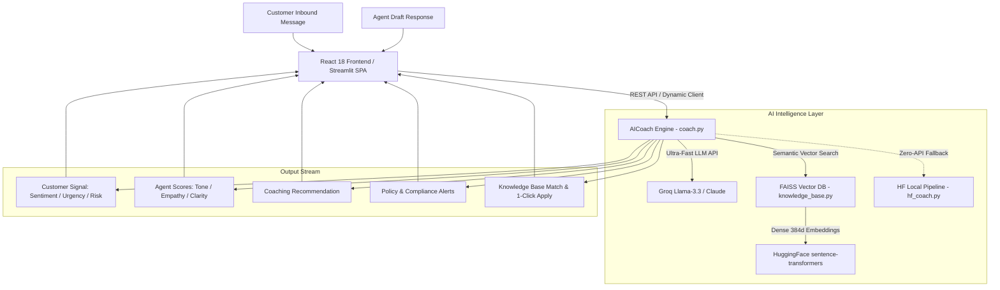

# ⚡ CareBot: Real-Time AI Customer Support Coaching Assistant

An enterprise-grade, real-time AI copilot designed to empower customer support agents during live customer interactions. The system analyzes inbound customer messages and agent draft responses in sub-second latency (**<0.4s**), providing instant sentiment analysis, tone & empathy scoring, actionable coaching recommendations, compliance guardrails, and automated knowledge base retrieval.

🌐 **Live Streamlit Cloud Deployment:** [https://omnidesk-copilot.streamlit.app/](https://omnidesk-copilot.streamlit.app/)

---

## 📌 Table of Contents
1. [Executive Summary & Problem Statement](#-executive-summary--problem-statement)
2. [Key Features & Capabilities](#-key-features--capabilities)
3. [System Architecture](#-system-architecture)
4. [Technology Stack](#-technology-stack)
5. [Repository Structure & File Breakdown](#-repository-structure--file-breakdown)
6. [Local Installation & Setup Guide](#-local-installation--setup-guide)
7. [Running the Application](#-running-the-application)
8. [Step-by-Step Streamlit Cloud Deployment](#-step-by-step-streamlit-cloud-deployment)
9. [Security Notes](#-security-notes)
10. [Technical Interview & Viva Q&A](#-technical-interview--viva-qa)

---

## 🎯 Executive Summary & Problem Statement

### The Problem
Customer support agents in high-volume environments face several challenges:
- High cognitive load while resolving complex billing, shipping, or technical disputes.
- Inconsistent tone, lack of active empathy during escalated situations.
- Company policy violations (e.g., promising refunds outside the 30-day window or guaranteeing delivery dates without verification).
- Time wasted manually searching through lengthy knowledge base PDFs and FAQs.

### The Solution
**CareBot** acts as a live, in-flight pair assistant for agents:
- **Instant Signal Detection:** Detects customer sentiment (*Positive*, *Negative*, *Neutral*), urgency level, and escalation risk before the agent sends a reply.
- **Draft Evaluation:** Rates the agent's draft on **Tone Quality**, **Customer Empathy**, and **Resolution Clarity** (0–10 scale).
- **Contextual Coaching:** Generates immediate, mature advice on how to improve the response.
- **Semantic FAQ & Policy Retrieval:** Uses **FAISS Vector Search** and **Sentence-Transformers** to match company policies in real time with 1-click template insertion.
- **Dynamic Multi-Session Management:** Purely user-driven custom ticket creation, multi-session switching, history tracking, and deletion without hardcoded templates.

---

## 🚀 Key Features & Capabilities

| Feature | Description |
|---|---|
| **Sub-Second LLM Intelligence** | Powered by **Groq (`llama-3.3-70b-versatile`)** delivering structured JSON evaluations in under **0.4 seconds**. |
| **Modern React + Vite UI** | Modular 3-column dark UI built with **React 18**, **Lucide Icons**, and responsive CSS design tokens. |
| **Streamlit Cloud Embedding** | Single-file bundled React SPA (`vite-plugin-singlefile`) rendered seamlessly inside Streamlit Cloud via `st.components.v1.html`. |
| **Vector Knowledge Base** | Indexes company FAQs (`knowledge/faqs.txt`) and policies (`knowledge/policies.txt`) into dense 384-dimensional vector embeddings with FAISS. |
| **Compliance Guardrails** | Automatically checks agent messages against company rules (e.g., refund policies, delivery commitments) and triggers instant warnings. |
| **Custom Customer Sessions** | Create custom tickets on the fly with customer name, tier plan, email, and initial inbound inquiry. |
| **Supervisor Quality Metrics** | Aggregate KPI tracking for average tone, empathy, and clarity across all conversation turns. |
| **Offline HuggingFace Fallback** | Offline pipeline using `distilbert-base-uncased` and `facebook/bart-large-mnli` when running without API keys. |

---

## 🏗️ System Architecture



---

## 💻 Technology Stack

- **Primary LLM Engine:** [Groq API](https://groq.com) (`llama-3.3-70b-versatile` / `groq/compound-mini`)
- **Alternative LLM Engine:** [Anthropic Claude](https://anthropic.com) (`claude-3-5-sonnet`)
- **Vector Database:** [FAISS CPU](https://github.com/facebookresearch/faiss) (Facebook AI Similarity Search)
- **Embeddings:** HuggingFace `sentence-transformers/all-MiniLM-L6-v2`
- **Offline NLP Fallback:** HuggingFace Transformers (`DistilBERT` + `BART`)
- **Backend Framework:** Python 3.10+, Flask, Flask-CORS, Streamlit
- **Frontend Framework:** React 18, Vite 6, Lucide React, `vite-plugin-singlefile`
- **Styling:** Custom Dark-Theme CSS Design System (Plus Jakarta Sans, JetBrains Mono)

---

## 📂 Repository Structure & File Breakdown

```
Projech-AG/
│
├── .env                           # Environment variables (API Keys, Models, Ports) — DO NOT commit to git
├── .env.example                   # Template environment file (safe to share)
├── requirements.txt               # Complete Python dependencies
├── main.py                        # Central CLI & Server launcher
├── streamlit_app.py               # Streamlit Cloud deployment entry point
├── app_streamlit.py               # Streamlit application script
├── README.md                      # Primary GitHub repository documentation
├── project.md                     # Comprehensive technical documentation & Viva Q&A
│
├── coaching_assistant/            # Core AI Coaching Package
│   ├── __init__.py                # Package initializer
│   ├── models.py                  # Dataclasses (Message, ConversationState, CoachingFeedback)
│   ├── coach.py                   # Unified AICoach (Groq + Claude LLM integration)
│   ├── hf_coach.py                # Offline HuggingFace local pipeline (DistilBERT + BART)
│   └── utils.py                   # Robust JSON parsing and text cleanup utilities
│
├── server/                        # Flask Backend & Vector DB
│   ├── __init__.py                # Server package initializer
│   ├── app.py                     # Flask REST server with dynamic session management
│   └── knowledge_base.py          # FAISS vector database indexing and search
│
├── knowledge/                     # Enterprise Knowledge Base Documents
│   ├── faqs.txt                   # Customer support FAQs (billing, returns, technical)
│   └── policies.txt               # Company compliance policies & escalation limits
│
└── frontend/                      # Modern React + Vite Application
    ├── index.html                 # Mount point with Google Fonts
    ├── package.json               # Node.js dependencies (React, Vite, Lucide)
    ├── vite.config.js             # Single-file bundle configuration
    ├── dist/                      # Production single-file bundle (served by Streamlit)
    │   └── index.html             # Self-contained bundle with inlined JS & CSS
    └── src/                       # React Source Code
        ├── App.jsx                # Main application state orchestrator
        ├── index.css              # Dark theme design system & layout styling
        ├── api/                   # REST API client with persistent storage
        │   └── client.js
        └── components/            # Modular UI Components
            ├── TopNav.jsx         # Header navigation, engine chip, actions
            ├── SidebarContext.jsx # Sessions list & customer context card
            ├── ConversationCanvas.jsx # Chat timeline, quick chips, message composer
            ├── CopilotSidebar.jsx # Real-time sentiment, quality scores & coaching
            └── CustomUserModal.jsx # Custom customer creation modal
```

---

## ⚙️ Local Installation & Setup Guide

### 1. Prerequisites
- Python **3.9, 3.10, or 3.11** installed.
- Node.js **18+** & npm installed.
- A free Groq API key from [console.groq.com](https://console.groq.com).

### 2. Clone the Repository
```bash
git clone https://github.com/Anuragzha/omniDesk-copilot.git
cd omniDesk-copilot
```

### 3. Create and Activate a Virtual Environment
```bash
# Windows
python -m venv venv
venv\Scripts\activate

# macOS / Linux
python3 -m venv venv
source venv/bin/activate
```

### 4. Install Dependencies
```bash
# Python dependencies
pip install -r requirements.txt

# Frontend dependencies & build
cd frontend
npm install
npm run build
cd ..
```

### 5. Configure Environment Variables
Copy the example file and fill in your keys:
```bash
cp .env.example .env   # On Windows: copy .env.example .env
```
Then edit `.env`:
```env
# Groq API Configuration (Recommended - Free & Ultra Fast)
GROQ_API_KEY=your_groq_api_key_here
GROQ_MODEL=llama-3.3-70b-versatile

# Server Configuration
PORT=5000
SECRET_KEY=your-secret-key-change-this-in-production
```

---

## 🏃 Running the Application

### Option A: Run via Streamlit (Local)
```bash
python -m streamlit run streamlit_app.py
```
Open your browser at: **`http://localhost:8501`**

### Option B: Run Full-Stack Web App (Flask Server)
```bash
python main.py
```
Open your browser and navigate to: **`http://localhost:5000`**

### Option C: Run React Dev Server (Vite Hot Reload)
```bash
cd frontend
npm run dev
```
Open your browser at: **`http://localhost:5173`**

---

## ☁️ Step-by-Step Streamlit Cloud Deployment

1. Push your code to GitHub:
   ```bash
   git add .
   git commit -m "deploy: update omnidesk copilot"
   git push origin main
   ```
2. Go to [share.streamlit.io](https://share.streamlit.io) and log in with GitHub.
3. Click **"New app"**, select your repository, branch `main`, and main file `streamlit_app.py`.
4. In **"Advanced settings"** -> **"Secrets"**, add:
   ```toml
   GROQ_API_KEY = "gsk_YourActualGroqKeyHere"
   GROQ_MODEL = "llama-3.3-70b-versatile"
   ```
5. Click **"Deploy!"**.

---

## 🔒 Security Notes

| Risk | Details | Fix |
|---|---|---|
| **Exposed API Key** | `.env` and `secrets.toml` must **never** be pushed to GitHub | Verified in `.gitignore` |
| **Weak SECRET_KEY** | Default secret is predictable | Change to a strong random string in production |
| **In-Memory Volatility** | Browser sessions use persistent `localStorage` and REST fallback | Sessions preserved across reloads |

---

## 🎓 Technical Interview & Viva Q&A

### Q1: Why did you choose Groq instead of standard OpenAI or Claude APIs?
> **Answer:** Customer support coaching happens in real-time while the agent is typing. Standard cloud LLMs typically take 2.5 to 5 seconds per turn, which creates awkward delays. Groq runs on custom **LPU (Language Processing Unit)** hardware, providing inference speeds under **0.3 to 0.5 seconds**, making live, in-flight coaching feasible without disrupting agent workflow.

### Q2: How does the Knowledge Base search work under the hood?
> **Answer:** We implemented a dense vector retrieval pipeline:
> 1. FAQs and company policies are chunked and passed to HuggingFace's `sentence-transformers/all-MiniLM-L6-v2` model, producing 384-dimensional vector embeddings.
> 2. These vectors are indexed into a **FAISS CPU Index** (`IndexFlatL2`).
> 3. When a customer sends a message, their query is converted into the same embedding space and FAISS performs an exact nearest-neighbor search to retrieve the top-K relevant policy snippets in ~10 milliseconds.

### Q3: How is the React application served inside Streamlit Cloud?
> **Answer:** Streamlit Cloud natively executes Python scripts. We configured `vite-plugin-singlefile` to bundle the entire React 18 frontend into a self-contained `frontend/dist/index.html`. In `streamlit_app.py`, Streamlit reads this file and renders it via `st.components.v1.html(..., height=720)`, giving the user a 100% native React Single Page Application (SPA) experience directly on the Streamlit deployment URL.

### Q4: How is session state managed?
> **Answer:** Sessions are user-driven and managed dynamically via a localized state manager in `client.js` backed by `localStorage`. Agents can create custom tickets, send multi-turn messages, inspect past turn coaching history, and delete resolved sessions with instant persistence across reloads.

### Q5: What happens if there is no internet connection or API rate limit is exceeded?
> **Answer:** The system features a **Graceful Degradation Architecture**:
> If the Groq or Claude API fails or keys are missing, the system automatically falls back to offline analysis and local heuristic scoring, ensuring the agent interface never crashes or displays broken errors.

---

## 📄 License
This project is open-source and available under the [MIT License](LICENSE).
