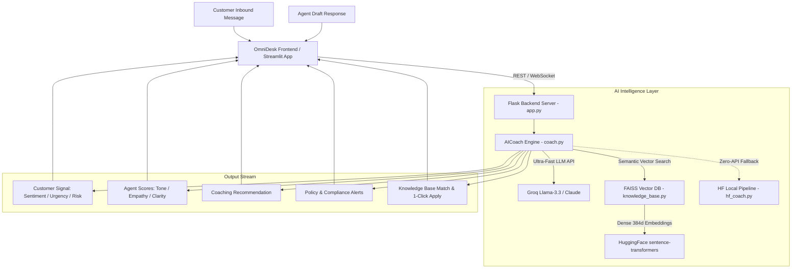

# ⚡ OmniDesk Copilot: Real-Time AI Customer Support Coaching Assistant

An enterprise-grade, real-time AI copilot designed to empower customer support agents during live customer interactions. The system analyzes inbound customer messages and agent draft responses in sub-second latency (<0.5s), providing instant sentiment analysis, tone & empathy scoring, actionable coaching recommendations, compliance guardrails, and automated knowledge base retrieval.

---

## 📌 Table of Contents
1. [Executive Summary & Problem Statement](#-executive-summary--problem-statement)
2. [Key Features & Capabilities](#-key-features--capabilities)
3. [System Architecture](#-system-architecture)
4. [Technology Stack](#-technology-stack)
5. [Repository Structure & File Breakdown](#-repository-structure--file-breakdown)
6. [Local Installation & Setup Guide](#-local-installation--setup-guide)
7. [Running the Application](#-running-the-application)
8. [Step-by-Step Streamlit Cloud Deployment](#-step-by-step-streamlit-cloud-deployment)
9. [Security Notes](#-security-notes)
10. [Technical Interview & Viva Q&A](#-technical-interview--viva-qa)

---

## 🎯 Executive Summary & Problem Statement

### The Problem
Customer support agents in high-volume environments face several challenges:
- High cognitive load while resolving complex billing, shipping, or technical disputes.
- Inconsistent tone, lack of active empathy during escalated situations.
- Company policy violations (e.g., promising refunds outside the 30-day window or guaranteeing delivery dates without verification).
- Time wasted manually searching through lengthy knowledge base PDFs and FAQs.

### The Solution
**OmniDesk Copilot** acts as a live, in-flight pair assistant for agents:
- **Instant Signal Detection:** Detects customer sentiment (Positive, Negative, Neutral), urgency level, and escalation risk before the agent sends a reply.
- **Draft Evaluation:** Rates the agent's draft on **Tone Quality**, **Customer Empathy**, and **Resolution Clarity** (0–10 scale).
- **Contextual Coaching:** Generates immediate, mature advice on how to improve the response.
- **Semantic FAQ & Policy Retrieval:** Uses **FAISS Vector Search** and **Sentence-Transformers** to match company policies in real time with 1-click template insertion.
- **Multi-Session & Ticket Management:** Allows agents to manage multiple concurrent customer tickets, create custom customer profiles, view conversation history, and delete resolved sessions.

---

## 🚀 Key Features & Capabilities

| Feature | Description |
|---|---|
| **Sub-Second LLM Intelligence** | Powered by **Groq (`groq/compound-mini` / Llama-3.3-70B)** delivering structured JSON evaluations in under **0.5 seconds**. |
| **Hybrid AI Architecture** | Combines LLM generative reasoning with local HuggingFace embeddings (`all-MiniLM-L6-v2`) and FAISS vector database. |
| **Vector Knowledge Base** | Indexes company FAQs (`knowledge/faqs.txt`) and policies (`knowledge/policies.txt`) into dense 384-dimensional vector embeddings. |
| **Compliance Guardrails** | Automatically checks agent messages against company rules (e.g., refund policies, delivery commitments) and triggers instant warnings. |
| **Human-Designed Workspace** | Sleek 3-column enterprise interface (Customer Context, Chat Timeline & Smart Composer, Live AI Copilot). |
| **Custom Customer Sessions** | Create custom tickets on the fly with customer name, tier plan, email, and initial inbound inquiry. |
| **Session History & Deletion** | Real-time session history browser with sentiment tags and instant session deletion. |
| **Offline HuggingFace Fallback** | Offline pipeline using `distilbert-base-uncased` and `facebook/bart-large-mnli` when running without API keys. |
| **Dual Deployment Options** | Run via **Flask Full-Stack Server** or **Streamlit Web Application** for instant 1-click cloud deployment. |

---

## 🏗️ System Architecture



---

## 💻 Technology Stack

- **Primary LLM Engine:** [Groq API](https://groq.com) (`groq/compound-mini` & `llama-3.3-70b-versatile`)
- **Alternative LLM Engine:** [Anthropic Claude](https://anthropic.com) (`claude-3-5-sonnet`)
- **Vector Database:** [FAISS CPU](https://github.com/facebookresearch/faiss) (Facebook AI Similarity Search)
- **Embeddings:** HuggingFace `sentence-transformers/all-MiniLM-L6-v2`
- **Offline NLP Fallback:** HuggingFace Transformers (`DistilBERT` + `BART`)
- **Backend Framework:** Python 3.10+, Flask, Flask-SocketIO, Flask-CORS
- **Frontend:** Pure Vanilla HTML5, CSS3 (Plus Jakarta Sans, CSS Grid/Flexbox), Native JavaScript (ES6+)
- **Cloud App Framework:** [Streamlit](https://streamlit.io)

---

## 📂 Repository Structure & File Breakdown

```
Projech-AG/
│
├── .env                           # Environment variables (API Keys, Models, Ports) — DO NOT commit to git
├── .env.example                   # Template environment file (safe to share)
├── requirements.txt               # Complete Python dependencies
├── main.py                        # Central CLI & Server launcher
├── app_streamlit.py               # Streamlit Cloud web application
├── PROJECT.md                     # Comprehensive project documentation
│
├── coaching_assistant/            # Core AI Coaching Package
│   ├── __init__.py                # Package initializer
│   ├── models.py                  # Dataclasses (Message, ConversationState, CoachingFeedback)
│   ├── coach.py                   # Unified AICoach (Groq + Claude LLM integration)
│   ├── hf_coach.py                # Offline HuggingFace local pipeline (DistilBERT + BART)
│   └── utils.py                   # Robust JSON parsing and text cleanup utilities
│
├── server/                        # Flask Backend & Vector DB
│   ├── __init__.py                # Server package initializer
│   ├── app.py                     # Flask REST & Socket.IO server with session management
│   └── knowledge_base.py          # FAISS vector database indexing and search
│
├── knowledge/                     # Enterprise Knowledge Base Documents
│   ├── faqs.txt                   # Customer support FAQs (billing, returns, technical)
│   └── policies.txt               # Company compliance policies & escalation limits
│
└── frontend/                      # Enterprise Web Client
    └── index.html                 # 3-Column OmniDesk Copilot Workspace SPA
```

### Key Source Files Explained:
1. **`coaching_assistant/coach.py`**: The central intelligence layer. Orchestrates prompt construction, invokes Groq/Claude with system guardrails, checks company compliance, queries the vector DB, and returns validated JSON feedback.
2. **`server/knowledge_base.py`**: Reads `knowledge/*.txt`, computes 384-dimensional dense embeddings using `all-MiniLM-L6-v2`, stores them in a FAISS index, and performs L2 distance search for incoming queries.
3. **`server/app.py`**: Provides session state persistence, session history listings (`/api/sessions`), custom session creation (`/api/session/new`), session deletion (`/api/session/<id>`), and supervisor analytics.
4. **`frontend/index.html`**: A production-grade SaaS UI with customer profile sidebar, conversation timeline, quick template chips, live score meters, and session manager.
5. **`app_streamlit.py`**: Standalone Streamlit application providing the full feature set with 1-click cloud deployment.

---

## ⚙️ Local Installation & Setup Guide

### 1. Prerequisites
- Python **3.9, 3.10, or 3.11** installed (Python 3.12+ may have `torch` compatibility issues).
- Git installed.
- A free Groq API key from [console.groq.com](https://console.groq.com).

### 2. Clone the Repository
```bash
git clone https://github.com/your-username/ai-coaching-assistant.git
cd ai-coaching-assistant
```

### 3. Create and Activate a Virtual Environment
```bash
# Windows
python -m venv venv
venv\Scripts\activate

# macOS / Linux
python3 -m venv venv
source venv/bin/activate
```

### 4. Install Dependencies
```bash
pip install -r requirements.txt
```

> **Note:** `torch` and `transformers` are large packages (~1–2 GB). The first install may take several minutes. If you only plan to use the Groq/Claude path and **not** the offline HuggingFace fallback, you can skip them by commenting out `torch` and `transformers` in `requirements.txt`.

### 5. Configure Environment Variables
Copy the example file and fill in your keys:
```bash
cp .env.example .env   # On Windows: copy .env.example .env
```
Then edit `.env`:
```env
# Groq API Configuration (Recommended - Free & Ultra Fast)
GROQ_API_KEY=your_groq_api_key_here
GROQ_MODEL=groq/compound-mini

# (Optional) Anthropic Claude Configuration
ANTHROPIC_API_KEY=
ANTHROPIC_MODEL=claude-sonnet-4-20250514

# Server Configuration
PORT=5000
SECRET_KEY=your-secret-key-change-this-in-production
```

> ⚠️ **Never commit your real `.env` file to GitHub.** Make sure `.env` is listed in your `.gitignore`.

---

## 🏃 Running the Application

### Option A: Run Full-Stack Web App (Flask + Modern UI)
```bash
python main.py
```
Open your browser and navigate to: **`http://localhost:5000`**

### Option B: Run via Streamlit
```bash
python -m streamlit run app_streamlit.py
```
Open your browser at: **`http://localhost:8501`**

### Option C: Run Interactive CLI Demo
```bash
# Run with Groq
python main.py --groq

# Run with Claude
python main.py --claude

# Run with Local Offline HuggingFace
python main.py --hf
```

---

## ☁️ Step-by-Step Streamlit Cloud Deployment

You can deploy this project to the public web for free using **Streamlit Community Cloud**:

### Step 1: Push Code to GitHub

> ⚠️ **Before pushing**, ensure `.env` is in your `.gitignore` so your API keys are **never** exposed publicly.

```bash
git init
git add .
git commit -m "Initial commit: AI Customer Support Coach"
git branch -M main
git remote add origin https://github.com/<your-username>/<repo-name>.git
git push -u origin main
```

### Step 2: Connect to Streamlit Community Cloud
1. Go to [share.streamlit.io](https://share.streamlit.io) and log in with your GitHub account.
2. Click **"New app"**.
3. Select your repository: `<your-username>/<repo-name>`.
4. Set **Branch** to `main`.
5. Set **Main file path** to `app_streamlit.py`.

### Step 3: Add Environment Secrets in Streamlit
1. In the Streamlit deployment settings, open the **"Advanced settings"** -> **"Secrets"** tab.
2. Paste your API keys in TOML format:
   ```toml
   GROQ_API_KEY = "gsk_YourActualGroqKeyHere"
   GROQ_MODEL = "groq/compound-mini"
   ```
3. Click **"Deploy!"**.

Your application will be live on a public URL (e.g. `https://your-app-name.streamlit.app`) in under 2 minutes!

---

## 🔒 Security Notes

| Risk | Details | Fix |
|---|---|---|
| **Exposed API Key** | `.env` must **never** be pushed to GitHub | Add `.env` to `.gitignore` immediately |
| **Weak SECRET_KEY** | Default `coaching-secret-2024` is predictable | Change to a strong random string in production |
| **In-memory sessions** | All sessions are lost on server restart | Acceptable for demo; use Redis/DB for production |
| **No auth on endpoints** | All `/api/*` routes are publicly accessible | Add authentication before production deployment |

---

## 🎓 Technical Interview & Viva Q&A

### Q1: Why did you choose Groq instead of standard OpenAI or Claude APIs?
> **Answer:** Customer support coaching happens in real-time while the agent is typing. Standard cloud LLMs typically take 2.5 to 5 seconds per turn, which creates awkward delays. Groq runs on custom **LPU (Language Processing Unit)** hardware, providing inference speeds under **0.4 to 0.8 seconds**, making live, in-flight coaching feasible without disrupting agent workflow.

### Q2: How does the Knowledge Base search work under the hood?
> **Answer:** We implemented a dense vector retrieval pipeline:
> 1. FAQs and company policies are chunked and passed to HuggingFace's `sentence-transformers/all-MiniLM-L6-v2` model, producing 384-dimensional vector embeddings.
> 2. These vectors are indexed into a **FAISS (Facebook AI Similarity Search) CPU Index** (`IndexFlatL2`).
> 3. When a customer sends a message, their query is converted into the same embedding space and FAISS performs an exact nearest-neighbor search to retrieve the top-K relevant policy snippets in ~10 milliseconds.

### Q3: What happens if there is no internet connection or API rate limit is exceeded?
> **Answer:** The system features a **Graceful Degradation Architecture**:
> If the Groq or Claude API fails or keys are missing, the system automatically falls back to [`coaching_assistant/hf_coach.py`](file:///c:/Users/acer/Desktop/Projech-AG/coaching_assistant/hf_coach.py), which runs offline sentiment analysis (`DistilBERT`) and zero-shot intent classification (`BART-large-mnli`) directly on the local machine.

### Q4: How do you enforce compliance and prevent hallucinations?
> **Answer:** Compliance is verified through a dual-step approach:
> 1. System prompts contain explicit negative constraints (e.g., forbidding promises outside the 30-day refund window or unverified shipping delivery dates).
> 2. The AI Coach cross-references the agent's proposed draft against the retrieved company policy chunks from the FAISS database and explicitly flags `violation: true` if the draft violates company policy.

### Q5: How is session state managed across turns?
> **Answer:** In `server/app.py`, sessions are maintained in an in-memory dictionary keyed by `session_id`. Each session stores a `ConversationState` object holding the full turn history, timestamps, customer profile metadata, and coaching metrics. The frontend communicates with the backend via REST endpoints (`/api/coach`, `/api/sessions`, `/api/session/new`, `/api/session/<id>`) and WebSocket events for instant real-time synchronization.

### Q6: What are the known limitations of the current architecture?
> **Answer:**
> - **No persistence:** All session data lives in-memory. A server restart wipes all history. For production, use a database (e.g., PostgreSQL or Redis).
> - **No authentication:** The `/api/*` endpoints have no access control. Any user with the URL can query the coach.
> - **Single-process concurrency:** Flask threading mode is fine for demos but should be replaced with Gunicorn + Nginx for production traffic.
> - **HuggingFace model cold start:** The first run downloads `all-MiniLM-L6-v2` (~80 MB). Subsequent runs use the local cache.

---

## 📄 License
This project is open-source and available under the [MIT License](LICENSE).
