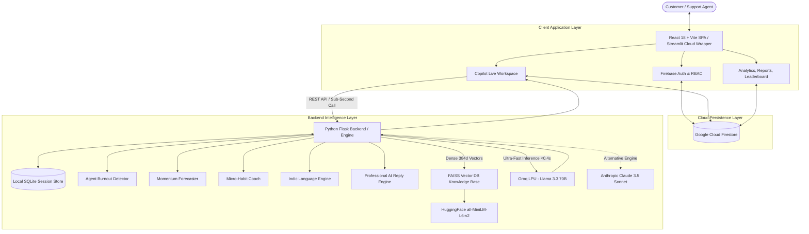

# OmniDesk Copilot: Real-Time AI Customer Support Intelligence &amp; Coaching Platform

[](https://customer-support-agent12.streamlit.app/)
[](https://reactjs.org/)
[](https://python.org/)
[-F55036?style=for-the-badge)](https://groq.com/)
[](https://firebase.google.com/)
[](https://github.com/facebookresearch/faiss)
[](LICENSE)

An enterprise-grade, real-time AI copilot and agent performance intelligence platform designed to assist customer support specialists during live customer interactions. Operating with sub-second latency (**&lt;0.4s**), OmniDesk Copilot analyzes inbound customer messages and agent draft responses in real time, delivering sentiment tracking, tone/empathy/clarity evaluation, compliance guardrails, automated vector knowledge retrieval, agent burnout detection, and conversation outcome forecasting.

- **Live Deployed Application:** [https://customer-support-agent12.streamlit.app/](https://customer-support-agent12.streamlit.app/)
- **GitHub Repository:** [https://github.com/Guptanshu44/Customer-support-assistant.git](https://github.com/Guptanshu44/Customer-support-assistant.git)

---

## Table of Contents
1. [Executive Summary &amp; Problem Statement](#executive-summary--problem-statement)
2. [System Architecture](#system-architecture)
3. [Core Intelligence Engines](#core-intelligence-engines)
4. [Application Modules &amp; Full Tour](#application-modules--full-tour)
5. [Enterprise Reliability &amp; Engineering Highlights](#enterprise-reliability--engineering-highlights)
6. [Technology Stack](#technology-stack)
7. [Repository Structure](#repository-structure)
8. [Installation &amp; Setup Guide](#installation--setup-guide)
9. [Running the Application](#running-the-application)
10. [Automated Testing &amp; Verification](#automated-testing--verification)
11. [System Design &amp; Technical Insights](#system-design--technical-insights)
12. [Security &amp; Data Governance](#security--data-governance)
13. [License](#license)

---

## Executive Summary &amp; Problem Statement

### The Problem
High-volume customer support operations face persistent operational challenges:
- **High Cognitive Load &amp; Fatigue:** Agents must simultaneously navigate hostile customer interactions, remember strict policy manuals, and draft fast responses.
- **Inconsistent Empathy &amp; Tone:** Stress and rush-to-resolve pressure often lead to blunt, defensive, or robotic replies that escalate customer frustration.
- **Compliance &amp; Policy Violations:** Accidental promises outside of SLA guidelines (e.g., unauthorized refunds, incorrect delivery guarantees) create major legal and financial exposure.
- **Agent Burnout &amp; High Attrition:** Unmonitored cognitive strain and emotional exhaustion lead to rapid turnover in support teams.
- **Slow Knowledge Retrieval:** Searching through disconnected PDF manuals and wikis adds minutes of delay to every interaction.

### The Solution
**OmniDesk Copilot** functions as an intelligent, in-flight pair assistant for support agents:
- **Sub-Second Live Evaluation:** Delivers structured analysis in **&lt;0.4 seconds** powered by Groq LPU hardware.
- **Real-Time Quality Scoring:** Evaluates draft responses on **Tone Alignment**, **Customer Empathy**, and **Direct Clarity** (1–10 scale).
- **Proactive Compliance Guardrails:** Identifies policy violations and compliance risks *before* messages are dispatched.
- **Instant Vector Knowledge Retrieval:** Dense semantic vector search via **FAISS** matches relevant policy clauses with 1-click apply.
- **Predictive Intelligence &amp; Wellness:** Monitors agent burnout index and predicts conversation momentum turn-by-turn.
- **Multilingual Support:** Native script detection and response generation for major Indic languages (Hindi, Tamil, Telugu, Kannada, Malayalam, Bengali, Gujarati).
- **Enterprise-Grade AI Reply Suggestions:** Generates context-aware replies following strict professional guidelines.

---

## System Architecture

OmniDesk Copilot implements a dual-runtime architecture supporting both a full-stack REST/WebSocket environment and a zero-infrastructure Streamlit Cloud deployment:



---

## Core Intelligence Engines

All novel coaching intelligence engines reside in `coaching_assistant/`:

### 1. Professional Enterprise AI Reply Engine (`coach.py` &amp; `client.js`)
Generates production-ready reply drafts that support agents can inject with 1 click. Enforces **6 strict enterprise hard rules**:
1. **Strict Plain Text:** Strips all markdown, bold formatting (`**`), asterisks, headers, and bullet formatting.
2. **Zero Emojis:** Strictly prohibited across all generated responses.
3. **No Verbatim Echoing:** Does not parrot the customer's exact words back to them.
4. **No Filler Openers:** Eliminates generic fluff (*"I would be delighted"*, *"I am happy to help"*).
5. **Multi-Turn Greeting Awareness:** Automatically suppresses greeting restarts (*"Hello"*, *"Hi"*) if a conversation is already underway.
6. **Context-Driven Escalation:** If the customer confirms earlier troubleshooting failed, immediately advances to advanced diagnostics or escalation without asking redundant questions.

| Dimension | Generic Chatbot Output | OmniDesk Copilot Output |
|---|---|---|
| **Tone &amp; Styling** | `**I understand you are facing issues!** 😊 Let me help!` | `Thank you for reaching out. Let me look into your connection status right away.` |
| **Troubleshooting Follow-Up** | `Have you tried restarting your router? 🔌` *(when user just said they restarted it)* | `Since restarting the router did not restore the connection, let us run a line diagnostic from our end.` |
| **Formatting** | Markdown bold, bullet lists, emoji decorators | Clean, professional, unformatted plain text ready for 1-click dispatch |

### 2. Agent Burnout Detector (`burnout_detector.py`)
- Continuously calculates a real-time **Burnout Index (0–100)** for active agents during long shifts.
- Analyzes sentiment friction, cognitive strain, empathy decline over extended turns, and exposure to hostility.
- Classifies risk into **Low** (0–39), **Medium** (40–69), and **Critical** (70–100), automatically alerting supervisors when rotation is recommended.
- **State-persistent across server restarts** — historical turns are replayed through the detector on startup so baselines are never lost.

### 3. Conversation Momentum Forecaster (`momentum_forecaster.py`)
- Analyzes turn-by-turn trajectory metrics to predict likely ticket outcomes: **Resolution**, **Escalation**, or **Churn Risk**.
- Provides confidence ratings (up to 95%), projected turns remaining until resolution, and actionable trajectory reasoning.
- **State-persistent across server restarts** — historical turn signals are restored during server bootstrap.

### 4. AI Micro-Habit Coach (`habit_coach.py`)
- Audits up to 200 historical turns across Empathy, Tone, and Clarity with full null-safe resilience.
- Pinpoints the agent's weakest communication dimension and issues targeted **Micro-Habit Practice Cards** with actionable sentence templates and turn goals.

### 5. Multilingual Indic Language Engine (`client.js` &amp; `coach.py`)
- Detects customer inquiries written in native Indic scripts (Devanagari, Tamil, Telugu, Kannada, Malayalam, Bengali, Gujarati) and romanized text (Hinglish, Tanglish).
- Generates replies and coaching recommendations in the **exact same native script** without transliteration.

### 6. FAISS Vector Knowledge Base (`server/knowledge_base.py`)
- Dense 384-dimensional embeddings generated via `sentence-transformers/all-MiniLM-L6-v2`.
- Matches customer inquiries to enterprise FAQs and policy documents in **&lt;10ms** using Euclidean distance (`IndexFlatL2`).

---

## Application Modules &amp; Full Tour

| Module | Route | Key Capabilities |
|---|---|---|
| **Copilot Live Workspace** | `/workspace` | 3-column assistant workspace featuring chat timeline with agent avatars, message composer, instant coaching tips, quality score rings (Tone, Empathy, Clarity), compliance alerts, and 1-click vector KB insertion. |
| **Interactive Landing Page** | `/` | SaaS product showcase with interactive scenario simulators (Double Charge, Delivery Tracking, Hindi Regional Query, Resolution), architecture pipeline, and ROI calculator. |
| **Operations Dashboard** | `/dashboard` | Executive command center with high-level KPI cards, real-time ticket stream, CSAT trends, priority distribution, and quick action shortcuts. |
| **Tickets Hub** | `/tickets` | 4-stage lifecycle (`Open`, `Pending`, `Resolved / Approved`, `Closed`), Admin cross-account oversight with email tags, individual agent scoping ("My Tickets" vs "All Tickets"), and real-time Firestore synchronization. |
| **Live Incoming Queue** | `/queue` | Live monitoring of unassigned inbound customer tickets with SLA countdowns, priority indicators, and 1-click ticket claiming. |
| **Analytics Dashboard** | `/analytics` | Dynamic time-series analytics with interactive date-range toggling (**Last 7 days** vs **Last 30 days**), resolution rate tracking, CSAT averages, and hourly volume heatmaps. |
| **Reports &amp; Audit Hub** | `/reports` | Role-governed audit reports (Admins see global company data; Agents see individual stats), SLA compliance metrics, sentiment breakdown, and CSV data export. |
| **Agent Performance** | `/performance` | Dynamic leaderboard featuring an adaptive 3-tier Olympic podium (responsively handling 1, 2, or 3+ agents), burnout risk chips, badge awards, and AI micro-habit cards. |
| **Team Management** | `/team` | Real-time roster of team members with role assignments (`Admin`, `Supervisor`, `Agent`), department filtering, and live online/away/offline status toggles synced to Cloud Firestore. |
| **Customer Directory** | `/customers` | Centralized customer CRM view with plan tiers, MRR/ARR values, lifetime value, and historical ticket logs. |
| **Settings &amp; Profile** | `/settings` | Profile updating (`displayName`), in-profile password creation and updates, 1-click password reset link dispatch, and AI inference configuration. |
| **Authentication** | `/auth` | Secure Firebase Authentication supporting sign-up, sign-in, persistent sessions, role management, and automated password reset email dispatch. |

---

## Enterprise Reliability &amp; Engineering Highlights

OmniDesk Copilot incorporates critical engineering patterns to ensure high concurrency, data integrity, and fault tolerance:

- **Thread-Safe Session Concurrency:** Session creation and counter increments are protected by a `threading.Lock()` to eliminate ID collisions under concurrent REST requests.
- **Relational Integrity &amp; Cascading Deletion:** The SQLite database utilizes explicit `FOREIGN KEY (session_id) REFERENCES sessions(id) ON DELETE CASCADE` constraints across `turns` and `agent_habit_log` tables.
- **Zero-Downtime Safe Schema Migration:** On startup, `init_db()` inspects SQLite PRAGMA foreign key metadata. If older schema definitions are detected, it safely migrates data into updated tables with constraints applied automatically without data loss.
- **Fault-Tolerant State Recovery Across Reboots:** On server restart, `_bootstrap_from_db()` reconstructs conversation state and replays historical turns through `AgentBurnoutDetector.observe()` and `ConversationMomentumForecaster.record_turn()`. Agent burnout baselines and momentum predictions survive server restarts.
- **Defensive API Error Handling:** Strict input validation across all endpoints ensures malformed payloads return standard HTTP status codes (`400 Bad Request`, `404 Not Found`) rather than silent null returns.

---

## Technology Stack

| Layer | Technologies | Key Function |
|---|---|---|
| **Frontend** | React 18, Vite 6, `vite-plugin-singlefile`, Lucide React | Modular 3-column UI compiled to a single distribution file (`&lt;1.3 MB`) |
| **AI Inference** | Groq LPU (`llama-3.3-70b-versatile`), Anthropic Claude (`claude-3-5-sonnet`) | Sub-second real-time scoring, analysis, and reply drafting |
| **Vector DB** | FAISS CPU (`IndexFlatL2`), HuggingFace `sentence-transformers/all-MiniLM-L6-v2` | Dense 384-dimensional policy search in `&lt;10ms` |
| **Backend &amp; APIs** | Python 3.10+, Flask, Flask-CORS, Gunicorn, RESTful APIs | Endpoint routing, session state management, and intelligence dispatch |
| **Cloud &amp; Persistence** | Google Firebase Auth, Cloud Firestore (Real-Time), SQLite3 | Real-time cross-device sync &amp; high-speed local session caching |
| **Deployment** | Streamlit Cloud (`st.components.v1.html`), Docker / Vercel compatible | Zero-infra cloud deployment with native iframe rendering |

---

## Repository Structure

```
omniDesk-copilot/
├── .env.example                   # Template environment configuration
├── requirements.txt               # Python package dependencies
├── main.py                        # Central CLI &amp; Flask server launcher
├── streamlit_app.py               # Streamlit Cloud deployment entry point
├── test_novel_features.py         # Automated smoke tests for coaching engines
├── README.md                      # Primary project documentation
├── PROJECT.md                     # Architecture reference document
│
├── coaching_assistant/            # Novel AI Coaching Intelligence Package
│   ├── __init__.py                # Package exports
│   ├── burnout_detector.py        # Real-time agent emotional exhaustion tracker
│   ├── coach.py                   # Unified AI Coach orchestrator (Groq &amp; Claude)
│   ├── habit_coach.py             # Contextual micro-habit coaching recommendations
│   ├── models.py                  # Dataclasses (Message, ConversationState, CoachingFeedback)
│   ├── momentum_forecaster.py     # Conversation trajectory and outcome forecaster
│   ├── session.py                 # In-memory session tracking utilities
│   └── utils.py                   # Robust JSON parsing and text cleanup routines
│
├── server/                        # Flask Backend &amp; Vector Knowledge Base
│   ├── __init__.py                # Server package initializer
│   ├── app.py                     # Flask REST API endpoints &amp; session lifecycle
│   ├── database.py                # SQLite persistence layer with schema migrations
│   └── knowledge_base.py          # FAISS dense vector search indexing &amp; querying
│
├── knowledge/                     # Enterprise Knowledge Base Corpus
│   ├── faqs.txt                   # Customer support FAQs (billing, technical, refunds)
│   └── policies.txt               # Enterprise SLA terms, compliance &amp; escalation limits
│
└── frontend/                      # React 18 Single-Page Application
    ├── index.html                 # Web mount point with Google Fonts
    ├── package.json               # Node.js dependencies
    ├── vite.config.js             # Vite configuration with single-file bundler
    ├── dist/                      # Production single-file bundle (served by Streamlit)
    │   └── index.html             # Self-contained SPA bundle (&lt;1.3 MB)
    └── src/
        ├── App.jsx                # Application root, routing &amp; authentication state
        ├── index.css              # Theme tokens, dark mode palette &amp; layout CSS
        ├── api/
        │   ├── client.js          # REST client, multi-session state &amp; Indic detector
        │   └── firebase.js        # Firebase Auth, Firestore real-time listeners &amp; sync
        ├── components/            # Reusable UI Components
        │   ├── AppShell.jsx       # Unified layout wrapper, sidebar &amp; navigation tabs
        │   ├── AuthModal.jsx      # Modal authentication dialog
        │   ├── CustomUserModal.jsx # Modal for custom customer session creation
        │   ├── SidebarContext.jsx # Ticket selector &amp; customer context card
        │   ├── ConversationCanvas.jsx # Chat feed, quick replies &amp; draft composer
        │   └── CopilotSidebar.jsx # Quality meters, coaching advice &amp; vector KB cards
        └── pages/                 # Full Application Pages
            ├── LandingPage.jsx    # SaaS product showcase with live scenario simulators
            ├── AuthPage.jsx       # Firebase Auth login, registration &amp; password reset
            ├── Dashboard.jsx      # Operations overview &amp; key metrics
            ├── Tickets.jsx        # Ticket queue &amp; management
            ├── LiveQueue.jsx      # Real-time inbound queue
            ├── Analytics.jsx      # Dynamic timeline &amp; performance analytics
            ├── Reports.jsx        # Role-based audit reports &amp; CSV export
            ├── AgentPerformance.jsx # Dynamic podium leaderboard &amp; habit coach
            ├── TeamManagement.jsx # Roster, roles &amp; live status toggles
            ├── Customers.jsx      # Customer directory CRM
            └── Settings.jsx       # Profile editing &amp; notification preferences
```

---

## Installation &amp; Setup Guide

### 1. Prerequisites
- **Python 3.10, 3.11, or 3.12**
- **Node.js 18+** and **npm**
- **Git**
- Free Groq API Key from [console.groq.com](https://console.groq.com)

### 2. Clone the Repository
```bash
git clone https://github.com/Guptanshu44/Customer-support-assistant.git
cd Customer-support-assistant
```

### 3. Python Virtual Environment Setup
```bash
# Windows
python -m venv venv
venv\Scripts\activate

# macOS / Linux
python3 -m venv venv
source venv/bin/activate
```

### 4. Install Dependencies &amp; Build Frontend
```bash
# Install Python backend dependencies
pip install -r requirements.txt

# Install frontend dependencies and compile production bundle
cd frontend
npm install
npm run build
cd ..
```

### 5. Configure Environment Variables
Copy `.env.example` to `.env` in the root folder:
```bash
cp .env.example .env
```
Populate `.env` with your credentials:
```env
GROQ_API_KEY=gsk_YourGroqApiKeyHere
GROQ_MODEL=llama-3.3-70b-versatile
PORT=5000
SECRET_KEY=your-secure-random-key
```

---

## Running the Application

### Option A: Streamlit Cloud / Local Wrapper (Recommended for Demonstrations)
```bash
streamlit run streamlit_app.py
```
Access the interface at: **`http://localhost:8501`**

### Option B: Flask Full-Stack Server
```bash
python main.py
```
Access the interface at: **`http://localhost:5000`**

### Option C: React Hot-Reloading Development Server
```bash
cd frontend
npm run dev
```
Access the dev server at: **`http://localhost:5173`**

---

## Automated Testing &amp; Verification

OmniDesk Copilot includes an automated test suite verifying all coaching intelligence engines:
```bash
python test_novel_features.py
```

**Expected Test Output:**
```
============================================================
  omniDesk-copilot — Coaching Intelligence Tests
============================================================

[1] Agent Burnout Detector
  burnout_index   : 69.7
  burnout_risk    : critical
  supervisor_action: Immediate supervisor intervention recommended.
  PASS

[2] Conversation Momentum Forecaster
  outcome_prediction  : resolution
  confidence          : 95 %
  turns_until_outcome : 1
  PASS

[3] Micro-Habit Coach
  weakest_dimension   : empathy
  habit               : Start every reply with an explicit acknowledgment sentence.
  PASS

============================================================
  ALL 3 ACTIVE FEATURE SMOKE TESTS PASSED
============================================================
```

---

## System Design &amp; Technical Insights

### Q1: Why choose Groq LPU over traditional OpenAI GPT-4 or Anthropic APIs?
> **Answer:** Customer support coaching occurs in real time while the agent is actively typing. Traditional cloud LLM APIs exhibit inference latencies of 2.5 to 5.0 seconds, which disrupts workflow and causes conversational lag. Groq runs on custom **Language Processing Units (LPUs)** designed specifically for sequential tensor processing, delivering structured response evaluations in **under 0.4 seconds**. This makes in-flight coaching feel instantaneous.

### Q2: How does the Knowledge Base vector retrieval pipeline work?
> **Answer:**
> 1. Enterprise policy documents and FAQs are chunked into self-contained text segments.
> 2. Each chunk is passed through `sentence-transformers/all-MiniLM-L6-v2` to produce dense 384-dimensional vector embeddings.
> 3. Embeddings are stored in an in-memory **FAISS CPU Index** (`IndexFlatL2`).
> 4. When a customer sends a message, it is embedded on the fly, and FAISS calculates Euclidean distances to retrieve the top matching policy snippets in **&lt;10ms**.

### Q3: How does the application maintain state synchronization between Firebase and SQLite?
> **Answer:** OmniDesk Copilot uses a hybrid architecture:
> - **Google Cloud Firestore:** Serves as the real-time cloud data store for cross-device multi-user synchronization, real-time ticket updates, team roster statuses, and audit reporting.
> - **SQLite3:** Acts as a high-speed local session and turn cache within the Python Flask backend, guaranteeing offline capability, ACID transactions, and fast historical turn queries.

### Q4: How is the React SPA embedded inside Streamlit Cloud?
> **Answer:** Streamlit natively expects Python scripts. We leveraged `vite-plugin-singlefile` to compile the entire React 18 application (HTML, CSS, JavaScript, and asset icons) into a self-contained single file at `frontend/dist/index.html`. In `streamlit_app.py`, Streamlit registers this distribution using `components.declare_component("omnidesk_copilot", path=_dist_dir)` and mounts it directly. This guarantees that the embedded iframe has a real origin domain for secure Firebase Auth persistence, and custom Streamlit CSS/JS injections suppress native floating badges for a native app experience.

### Q5: How does the Agent Burnout Detector determine risk levels?
> **Answer:** The burnout algorithm evaluates three weighted vectors across a sliding window of recent conversation turns:
> 1. **Sentiment Trajectory:** Persistent negative customer friction without recovery.
> 2. **Empathy Degradation:** Decreasing empathy scores across successive turns indicating cognitive fatigue.
> 3. **Turn Velocity &amp; Urgency:** Rapid back-to-back high-urgency turns without sufficient resolution breaks.
> When the calculated Burnout Index exceeds critical thresholds, the system flags the agent and recommends supervisor reassignment.

### Q6: How does the AI Reply Suggestion engine ensure professional enterprise output?
> **Answer:** The `suggest_reply()` method in `coach.py` uses a structured prompt with numbered hard rules enforced at the LLM level:
> 1. **Plain text only** — no markdown, bold (`**`), asterisks, or bullet symbols.
> 2. **Zero emojis** of any kind.
> 3. **No echoing** of the customer's exact words back to them verbatim.
> 4. **No filler openers** such as "I would be delighted", "I am happy to help", or "Great question".
> 5. **No greeting restarts** if the conversation is already in progress (multi-turn awareness).
> 6. **Context-driven escalation** — if the customer confirms steps were completed and the issue persists, the reply immediately moves to the next resolution action without re-asking answered questions.

---

## Security &amp; Data Governance

- **Zero Hardcoded Secrets:** All API keys and Firebase credentials use environment variables (`.env`) or Streamlit Cloud Secrets.
- **Strict Gitignore:** Sensitive configuration files (`.env`, `secrets.toml`, `.venv`, `*.db`, and `__pycache__/`) are strictly excluded from git tracking.
- **Role-Based Access Control (RBAC):** Granular permissions ensure Agents only access assigned tickets and personal reports, while Supervisors and Admins access full organization data.
- **Client-Side Sanitization:** All inbound customer messages and outbound replies are validated and sanitized before persistence.
- **Thread-Safe Session Concurrency:** Session ID generation uses a `threading.Lock()` to prevent race conditions and ID collisions under concurrent requests.

---

## License

This project is licensed under the **MIT License** — see the [LICENSE](LICENSE) file for details.
