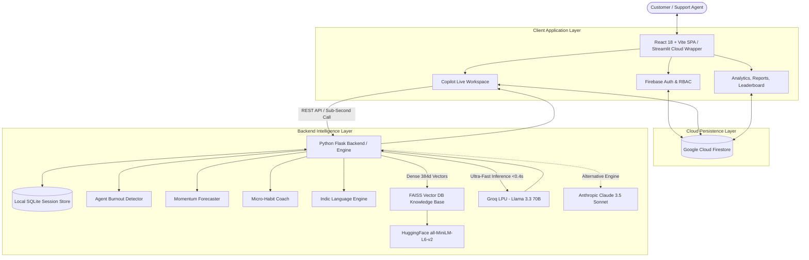

# OmniDesk Copilot: Real-Time AI Customer Support Intelligence & Coaching Platform

[](https://customer-support-agent12.streamlit.app/)
[](https://reactjs.org/)
[](https://python.org/)
[-F55036?style=for-the-badge)](https://groq.com/)
[](https://firebase.google.com/)
[](https://github.com/facebookresearch/faiss)
[](LICENSE)

An enterprise-grade, real-time AI copilot and agent performance intelligence suite designed to empower customer support teams during live interactions. Operating with sub-second latency (**<0.4s**), OmniDesk Copilot analyzes inbound customer messages and draft agent responses in real time, delivering sentiment tracking, tone and empathy evaluation, compliance guardrails, automated vector knowledge retrieval, agent burnout detection, and conversation outcome forecasting.

**Live Deployed App:** [https://customer-support-agent12.streamlit.app/](https://customer-support-agent12.streamlit.app/)  
**GitHub Repository:** [https://github.com/Guptanshu44/Customer-support-assistant.git](https://github.com/Guptanshu44/Customer-support-assistant.git)

---

## Table of Contents
1. [Executive Summary & Problem Statement](#executive-summary--problem-statement)
2. [Core Intelligence Engines (Novel AI Features)](#core-intelligence-engines-novel-ai-features)
3. [Full Application Tour & Key Modules](#full-application-tour--key-modules)
4. [System Architecture](#system-architecture)
5. [Technology Stack](#technology-stack)
6. [Repository Structure](#repository-structure)
7. [Installation & Setup Guide](#installation--setup-guide)
8. [Running the Application](#running-the-application)
9. [Running Automated Tests](#running-automated-tests)
10. [Streamlit Cloud Deployment Guide](#streamlit-cloud-deployment-guide)
11. [Security & Data Governance](#security--data-governance)
12. [System Design & Technical Insights](#system-design--technical-insights)
13. [License](#license)

---

## Executive Summary & Problem Statement

### The Problem
Customer support teams in enterprise environments face persistent operational bottlenecks:
- **High Cognitive Load & Stress:** Agents juggle complex ticket scenarios, angry customers, and rigid policy manuals simultaneously.
- **Inconsistent Tone & Lack of Empathy:** Rush-to-resolve pressure often leads to robotic, defensive, or unsympathetic replies that increase customer frustration.
- **Compliance & Policy Violations:** Accidental promises outside of SLA guidelines (e.g., unauthorized refunds, incorrect delivery guarantees) cost enterprises millions annually.
- **Agent Burnout & High Turnover:** Unmonitored emotional exhaustion and continuous escalations lead to high agent attrition rates.
- **Slow Knowledge Retrieval:** Manually searching through disconnected wikis and PDF knowledge bases adds minutes of delay to each customer interaction.

### The Solution
**OmniDesk Copilot** functions as an intelligent, in-flight pair coach for support specialists:
- **Sub-Second Live Evaluation:** Analyzes customer signals and agent drafts in **<0.4 seconds** powered by Groq LPU hardware.
- **Real-Time Quality Scoring:** Evaluates every response draft on **Tone Alignment**, **Customer Empathy**, and **Direct Clarity** (0–10 scale).
- **Proactive Compliance Guardrails:** Catches policy violations and compliance risks *before* the message is sent.
- **Instant Vector Knowledge Retrieval:** Dense semantic search indexed via **FAISS** surfaces exact policy clauses with 1-click apply.
- **Predictive Intelligence & Agent Wellness:** Monitors agent burnout index and predicts conversation resolution momentum turn-by-turn.
- **Multilingual Support:** Native language detection and coaching for major Indic languages (Hindi, Tamil, Telugu, Kannada, Malayalam, Bengali, Gujarati).

---

## Core Intelligence Engines (Novel AI Features)

OmniDesk Copilot integrates four specialized intelligence engines under `coaching_assistant/`:

### 1. Agent Burnout Detector (`burnout_detector.py`)
- Continuously calculates a real-time **Burnout Index (0–100)** for active agents during long shifts.
- Analyzes sentiment friction, cognitive strain, empathy decline over extended turns, and customer hostility spikes.
- Classifies risk into **Low**, **Medium**, and **Critical**, automatically alerting supervisors when immediate intervention or shift rotation is recommended.

### 2. Conversation Momentum Forecaster (`momentum_forecaster.py`)
- Analyzes turn-by-turn trajectory metrics to predict likely ticket outcomes: **Resolution**, **Escalation**, or **Churn Risk**.
- Provides confidence ratings (up to 95%), projected turns remaining until resolution, and actionable trajectory reasoning.

### 3. AI Micro-Habit Coach (`habit_coach.py`)
- Dynamically audits agent conversation history across Empathy, Tone, and Clarity with full null-safe resilience against incomplete, malformed, or zero-turn turn histories.
- Pinpoints the agent's weakest communication dimension and issues targeted **Micro-Habit Practice Cards** with actionable sentence templates and turn-based goals.

### 4. Indic Regional Language Engine (`client.js` & `coach.py`)
- Detects customer inquiries written in native Indic scripts (Devanagari, Tamil, Telugu, Kannada, Malayalam, Bengali, Gujarati) as well as phonetic romanized text (Hinglish, Tanglish).
- Adapts coaching tips and knowledge base recommendations to regional customer preferences.

---

## Full Application Tour & Key Modules

| Module | Location | Description |
|---|---|---|
| **Copilot Live Workspace** | `/workspace` | 3-column live assistant workspace featuring chat timeline with dynamic agent identity & avatar initials, message composer, instant coaching tips, quality score rings, compliance alerts, and 1-click vector KB snippet injection. |
| **Interactive Landing Page** | `/` | Premium SaaS product landing page with interactive scenario simulators (Double Charge, Delivery Tracking, Hindi Regional Query, Resolution), architecture pipeline, ROI calculator, and testimonials. |
| **Operations Dashboard** | `/dashboard` | Executive command center with high-level KPI cards, real-time ticket stream, CSAT trends, priority distribution, and quick action shortcuts. |
| **Tickets & Queue Hub** | `/tickets` | Full ticket lifecycle management supporting all 4 statuses (`Open`, `Pending`, `Resolved / Approved`, `Closed`) at creation and runtime, Admin cross-account oversight with email tags, individual agent scoping ("My Tickets" vs "All Tickets"), real-time Firestore synchronization, and 1-click workspace session opening parity. |
| **Live Incoming Queue** | `/queue` | Live monitoring of unassigned inbound customer tickets with SLA countdowns, priority indicators, and instant ticket claiming. |
| **Analytics Dashboard** | `/analytics` | Dynamic time-series analytics with interactive date-range toggling (**Last 7 days** vs **Last 30 days**), resolution rate tracking, CSAT averages, and hourly volume heatmaps. |
| **Reports & Audit Hub** | `/reports` | Role-governed audit reports (Admins see global company data; Agents see individual stats), SLA compliance metrics, sentiment breakdown, and CSV data export. |
| **Agent Performance & Leaderboard** | `/performance` | Dynamic leaderboard featuring an adaptive 3-tier Olympic podium (responsively handling 1, 2, or 3+ agents), dual name/email/userAccount ticket attribution matching, burnout risk chips, badge awards, and AI micro-habit cards. |
| **Team Management** | `/team` | Real-time roster of team members with role assignments (`Admin`, `Supervisor`, `Agent`), department filtering, active agent presence guarantees ensuring fresh rosters never render empty, and live online/away/offline status toggles synced to Cloud Firestore. |
| **Customer Directory** | `/customers` | Centralized customer CRM view with plan tiers, MRR/ARR values, lifetime value, and historical ticket logs. |
| **Settings & Profile Management** | `/settings` | Firebase Auth profile updating (`displayName`), in-profile password creation and updates for direct email accounts, 1-click password reset link dispatch, and AI inference configuration. |
| **Authentication & Password Recovery** | `/auth` | Secure Firebase Authentication supporting sign-up, sign-in, persistent sessions, role management, and automated password reset email dispatch. |

### Ticket Lifecycle & Multi-Tier Role Governance Architecture

OmniDesk Copilot features an enterprise ticket management engine backed by Google Cloud Firestore and client-side resilience fallbacks:
- **4-Stage Status Lifecycle (`Open`, `Pending`, `Resolved / Approved`, `Closed`):**
  - Agents and administrators can set the ticket status immediately upon creation via the **New Ticket Modal**.
  - Interactive status controls are accessible directly within each table row and within the right-hand **Ticket Detail Panel** for 1-click status transitions.
  - Bulk toolbar actions support mass resolving, reopening, closing, or deleting tickets.
- **Administrator Global Oversight:**
  - System administrators and supervisors have an unfiltered view across **all tickets from all user accounts**.
  - Every ticket displays the respective user account email (`agentEmail` / `userAccount`) with dedicated visual badges.
  - An interactive **User Account Filter Dropdown** allows admins to isolate tickets created by or assigned to specific team members or view the aggregate queue.
- **Individual Agent Scoping & Instant Visibility:**
  - Individual support specialists have access to a dedicated **"My Tickets" vs "All Tickets"** toggle switch.
  - Creating a ticket automatically records creator credentials (`agentEmail`, `agentId`, `createdBy`, `userAccount`, ISO timestamps) and auto-resets active filters, guaranteeing that newly created tickets are never hidden or lost.
- **Resilient Multi-Session Synchronization & Backend Parity:**
  - Dynamic session generation in `createFreshSession` cleanly synchronizes newly initialized sessions to the Python Flask backend (`POST /api/session/new`) and Cloud Firestore with comprehensive error shielding.
  - The backend `is_mock_session` engine selectively targets only legacy seed constants without dropping valid user-created customer sessions or normal customer names.
  - Queries avoid rigid server-side timestamp constraints that exclude newly created or unindexed documents. Client-side chronological sorting ensures zero dropped records.
  - Automated purge routines strictly safeguard all user-created tickets and active agent records, only targeting legacy demo seed constants.
- **Unified Workspace Linking:**
  - Clicking **"Open in Workspace"** seamlessly links the ticket ID and customer context directly to the 3-column AI Copilot workspace.

---

## System Architecture



---

## Technology Stack

| Layer | Technologies |
|---|---|
| **Frontend** | React 18, Vite 6, `vite-plugin-singlefile`, Lucide React, Custom CSS Design System (JetBrains Mono, Plus Jakarta Sans) |
| **AI Inference** | Groq LPU (`llama-3.3-70b-versatile`), Anthropic Claude (`claude-3-5-sonnet`) |
| **Vector Search** | FAISS CPU (`IndexFlatL2`), HuggingFace `sentence-transformers/all-MiniLM-L6-v2` |
| **Backend & APIs** | Python 3.10+, Flask, Flask-CORS, Gunicorn, RESTful APIs |
| **Cloud & Database** | Google Firebase Authentication, Cloud Firestore (Real-Time), SQLite3 |
| **Deployment** | Streamlit Cloud (`st.components.v1.html`), Vercel / Render / Docker compatible |

---

## Repository Structure

```
omniDesk-copilot/
├── .env.example                   # Template environment configuration
├── requirements.txt               # Python package dependencies
├── main.py                        # Central CLI & Flask server launcher
├── streamlit_app.py               # Streamlit Cloud deployment entry point
├── test_novel_features.py         # Automated smoke tests for coaching engines
├── README.md                      # Primary project documentation
├── project.md                     # Technical architecture documentation
│
├── coaching_assistant/            # Novel AI Coaching Intelligence Package
│   ├── __init__.py                # Package exports
│   ├── burnout_detector.py        # Real-time agent emotional exhaustion tracker
│   ├── coach.py                   # Unified AI Coach orchestrator (Groq & Claude)
│   ├── habit_coach.py             # Contextual micro-habit coaching recommendations
│   ├── models.py                  # Dataclasses (Message, ConversationState, CoachingFeedback)
│   ├── momentum_forecaster.py     # Conversation trajectory and outcome forecaster
│   ├── session.py                 # In-memory session tracking utilities
│   └── utils.py                   # Robust JSON parsing and text cleanup routines
│
├── server/                        # Flask Backend & Vector Knowledge Base
│   ├── __init__.py                # Server package initializer
│   ├── app.py                     # Flask REST API endpoints & session lifecycle
│   ├── database.py                # SQLite persistence layer for tickets & turns
│   └── knowledge_base.py          # FAISS dense vector search indexing & querying
│
├── knowledge/                     # Enterprise Knowledge Base Corpus
│   ├── faqs.txt                   # Customer support FAQs (billing, technical, refunds)
│   └── policies.txt               # Enterprise SLA terms, compliance & escalation limits
│
└── frontend/                      # React 18 Single-Page Application
    ├── index.html                 # Web mount point with Google Fonts
    ├── package.json               # Node.js dependencies
    ├── vite.config.js             # Vite configuration with single-file bundler
    ├── dist/                      # Production single-file bundle (served by Streamlit)
    │   └── index.html             # Self-contained SPA bundle (<1.3 MB)
    └── src/
        ├── App.jsx                # Application root, routing & authentication state
        ├── index.css              # Theme tokens, dark mode palette & layout CSS
        ├── api/
        │   ├── client.js          # REST client, multi-session state & Indic detector
        │   └── firebase.js        # Firebase Auth, Firestore real-time listeners & sync
        ├── components/            # Reusable UI Components
        │   ├── AppShell.jsx       # Unified layout wrapper, sidebar & navigation tabs
        │   ├── AuthModal.jsx      # Modal authentication dialog
        │   ├── CustomUserModal.jsx # Modal for custom customer session creation
        │   ├── SidebarContext.jsx # Ticket selector & customer context card
        │   ├── ConversationCanvas.jsx # Chat feed, quick replies & draft composer
        │   └── CopilotSidebar.jsx # Quality meters, coaching advice & vector KB cards
        └── pages/                 # Full Application Pages
            ├── LandingPage.jsx    # SaaS product showcase with live scenario simulators
            ├── AuthPage.jsx       # Firebase Auth login, registration & password reset
            ├── Dashboard.jsx      # Operations overview & key metrics
            ├── Tickets.jsx        # Ticket queue & management
            ├── LiveQueue.jsx      # Real-time inbound queue
            ├── Analytics.jsx      # Dynamic timeline & performance analytics
            ├── Reports.jsx        # Role-based audit reports & CSV export
            ├── AgentPerformance.jsx # Dynamic podium leaderboard & habit coach
            ├── TeamManagement.jsx # Roster, roles & live status toggles
            ├── Customers.jsx      # Customer directory CRM
            └── Settings.jsx       # Profile editing & notification preferences
```

---

## Installation & Setup Guide

### 1. Prerequisites
- **Python 3.10, 3.11, or 3.12**
- **Node.js 18+** and **npm**
- **Git**
- Free Groq API Key from [console.groq.com](https://console.groq.com)

### 2. Clone the Repository
```bash
git clone https://github.com/Guptanshu44/Customer-support-assistant.git
cd Customer-support-assistant
```

### 3. Python Virtual Environment Setup
```bash
# Windows
python -m venv venv
venv\Scripts\activate

# macOS / Linux
python3 -m venv venv
source venv/bin/activate
```

### 4. Install Dependencies & Build Frontend
```bash
# Install Python backend dependencies
pip install -r requirements.txt

# Install frontend dependencies and compile production bundle
cd frontend
npm install
npm run build
cd ..
```

### 5. Configure Environment Variables
Copy `.env.example` to `.env` in the root folder:
```bash
cp .env.example .env
```
Populate `.env` with your credentials:
```env
GROQ_API_KEY=gsk_YourGroqApiKeyHere
GROQ_MODEL=llama-3.3-70b-versatile
PORT=5000
SECRET_KEY=your-secure-random-key
```

---

## Running the Application

### Option A: Streamlit Cloud / Local Wrapper (Recommended for Demonstrations)
```bash
streamlit run streamlit_app.py
```
Access the interface at: **`http://localhost:8501`**

### Option B: Flask Full-Stack Server
```bash
python main.py
```
Access the interface at: **`http://localhost:5000`**

### Option C: React Hot-Reloading Development Server
```bash
cd frontend
npm run dev
```
Access the dev server at: **`http://localhost:5173`**

---

## Running Automated Tests

OmniDesk Copilot includes an automated test suite verifying all coaching intelligence engines:
```bash
python test_novel_features.py
```

**Expected Output:**
```
============================================================
  omniDesk-copilot — Coaching Intelligence Tests
============================================================

[1] Agent Burnout Detector
  burnout_index   : 69.7
  burnout_risk    : critical
  supervisor_action: Immediate supervisor intervention recommended.
  PASS

[2] Conversation Momentum Forecaster
  outcome_prediction  : resolution
  confidence          : 95 %
  turns_until_outcome : 1
  PASS

[3] Micro-Habit Coach
  weakest_dimension   : empathy
  habit               : Start every reply with an explicit acknowledgment sentence.
  PASS

============================================================
  ALL 3 ACTIVE FEATURE SMOKE TESTS PASSED
============================================================
```

---

## Streamlit Cloud Deployment Guide

1. Push your latest code to GitHub:
   ```bash
   git add .
   git commit -m "deploy: update omnidesk copilot"
   git push origin main
   ```
2. Navigate to [share.streamlit.io](https://share.streamlit.io) and click **New app**.
3. Select your repository: `Guptanshu44/Customer-support-assistant`, branch `main`.
4. Set **Main file path** to `streamlit_app.py`.
5. Under **Advanced settings** -> **Secrets**, insert:
   ```toml
   GROQ_API_KEY = "gsk_YourActualGroqKeyHere"
   GROQ_MODEL = "llama-3.3-70b-versatile"
   ```
6. Click **Deploy**. Streamlit Cloud will launch the embedded single-file React SPA.

---

## Security & Data Governance

- **Zero Hardcoded Secrets:** All API keys and Firebase credentials use environment variables (`.env`) or Streamlit Cloud Secrets.
- **Strict Gitignore:** Sensitive configuration files (`.env`, `secrets.toml`, `.venv`, and `*.db`) are strictly excluded from git tracking.
- **Role-Based Access Control (RBAC):** Granular permissions ensure Agents only access assigned tickets and personal reports, while Supervisors and Admins access full organization data.
- **Client-Side Sanitization:** All inbound customer messages and outbound replies are validated and sanitized before persistence.

---

## System Design & Technical Insights

### Q1: Why did you choose Groq LPU over OpenAI GPT-4 or standard Anthropic APIs?
> **Answer:** Customer support coaching occurs in real time while the agent is actively typing. Traditional cloud LLM APIs exhibit inference latencies of 2.5 to 5.0 seconds, which disrupts workflow and causes awkward conversational delays. Groq runs on custom **Language Processing Units (LPUs)** designed specifically for sequential tensor processing, delivering response evaluations in **under 0.4 seconds**. This makes in-flight coaching feel instantaneous.

### Q2: How does the Knowledge Base vector retrieval pipeline work?
> **Answer:**
> 1. Enterprise policy documents and FAQs are chunked into self-contained text segments.
> 2. Each chunk is passed through `sentence-transformers/all-MiniLM-L6-v2` to produce dense 384-dimensional vector embeddings.
> 3. Embeddings are stored in a **FAISS CPU Index** (`IndexFlatL2`).
> 4. When a customer sends a message, it is embedded on the fly, and FAISS calculates Euclidean distances to retrieve the top matching policy snippets in **<10ms**.

### Q3: How does the application maintain state synchronization between Firebase and SQLite?
> **Answer:** OmniDesk Copilot uses a hybrid architecture:
> - **Google Cloud Firestore:** Serves as the real-time cloud data store for cross-device multi-user synchronization, real-time ticket updates, team roster statuses, and audit reporting.
> - **SQLite3:** Acts as a high-speed local session and turn cache within the Python Flask backend, guaranteeing offline capability and fast historical turn queries.

### Q4: How is the React SPA embedded inside Streamlit Cloud?
> **Answer:** Streamlit natively expects Python scripts. We leveraged `vite-plugin-singlefile` to compile the entire React 18 application (HTML, CSS, JavaScript, and asset icons) into a self-contained single file at `frontend/dist/index.html`. In `streamlit_app.py`, Streamlit registers this distribution using `components.declare_component("omnidesk_copilot", path=_dist_dir)` and invokes it directly. This guarantees that the embedded iframe has a real origin domain for secure Firebase Auth persistence, and custom Streamlit CSS/JS injections suppress native floating badges for a native, distraction-free app experience.

### Q5: How does the Agent Burnout Detector determine risk levels?
> **Answer:** The burnout algorithm evaluates three weighted vectors across a sliding window of recent conversation turns:
> 1. **Sentiment Trajectory:** Persistent negative customer friction without recovery.
> 2. **Empathy Degradation:** Decreasing empathy scores across successive turns indicating cognitive fatigue.
> 3. **Turn Velocity & Urgency:** Rapid back-to-back high-urgency turns without sufficient resolution breaks.
> When the calculated Burnout Index exceeds critical thresholds, the system flags the agent and recommends supervisor reassignment.

---

## License

This project is licensed under the **MIT License** — see the [LICENSE](LICENSE) file for details.

Developed for high-performance customer support teams.
